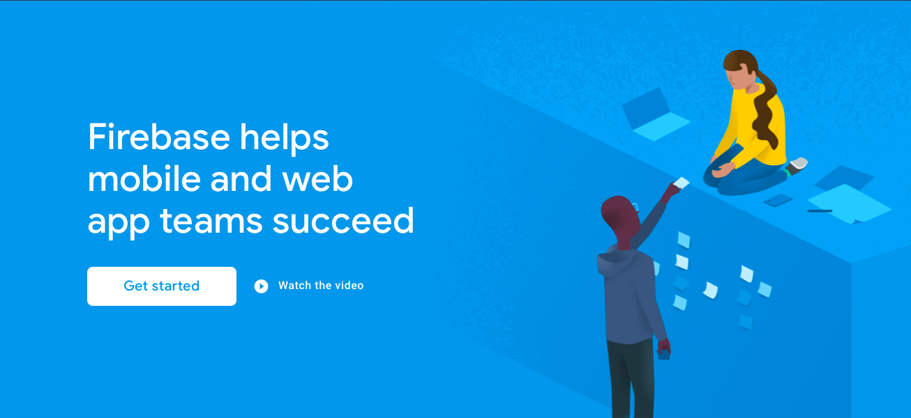
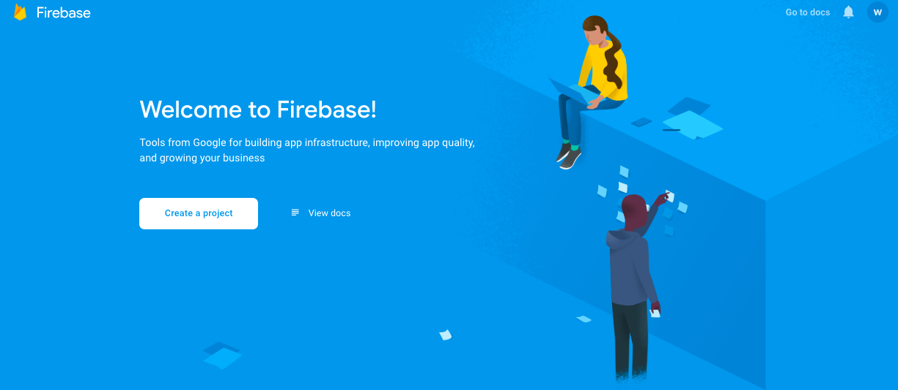
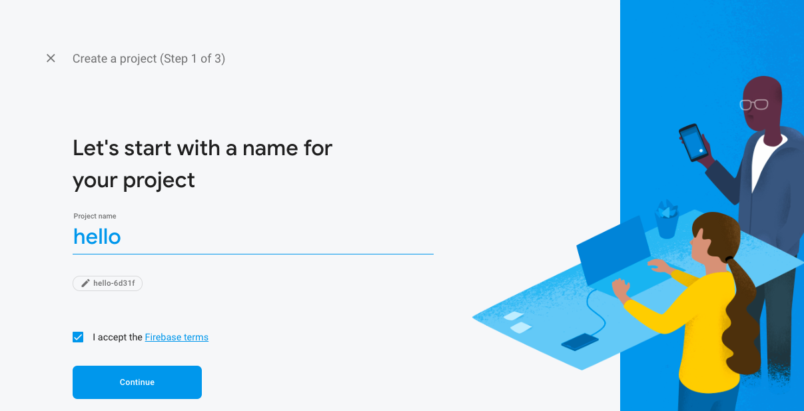
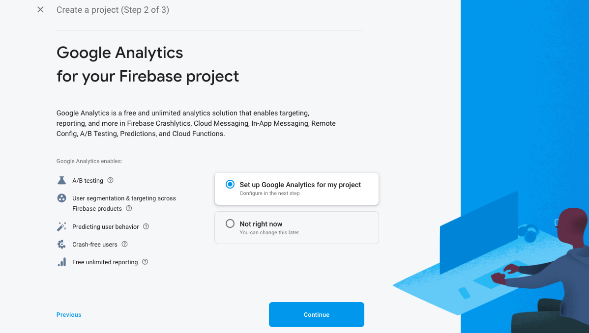
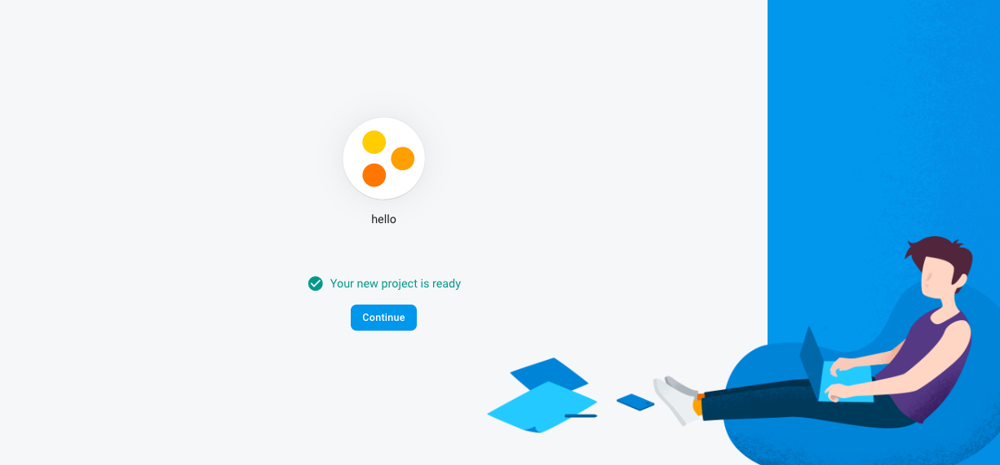
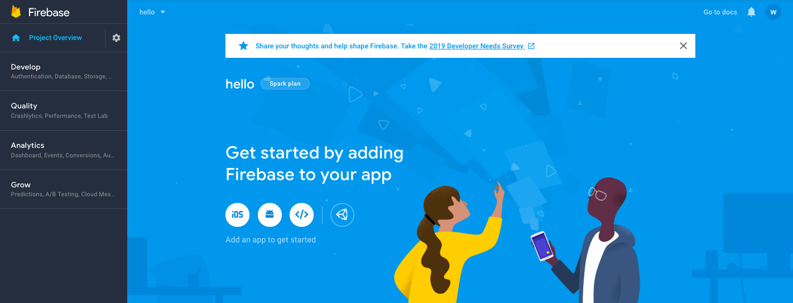

# Express & React on Firebase

Kata orang, hosting aplikasi node.js itu mahal. Tidak. Dengan firebase, kita bisa mendapatkannya secara gratis. Bagaimana caranya?

## Create Firebase Project

1. Buka [firebase.com](http://firebase.com). Daftar. Klik **get started**:
   
2. Buat proyek baru. Klik **create project**:
   
3. Beri nama, misalnya 'hello'. Jangan lupa klik **accept** dan **continue**:
   
4. Setting Google Analytics. Klik **Continue**:
   
5. Jangan lupa terima semua option. Lalu klik **create project**:
   
6. Jika sukses hasilnya begini. Klik **continue**:
   
7. Berikut tampilan dashboard proyek. Proses pembuatan proyek selesai.
   

## Setup Firebase

1. Instal firebase-tools
   ```
   $ npm install -g firebase-tools
   ```
2. Update file `src/server.js`:

   ```js
   const functions = require("firebase-functions");
   const express = require("express");

   const app = express();

   app.get("*", (req, res) => {
     res.send("Hello from Express on Firebase!");
   });

   exports.api = functions.https.onRequest(app);
   ```

3. Install firebase-functions:
   ```
   $ npm i firebase-functions firebase-admin
   ```
4. Update webpack.config.js:

   ```js
    const pkg = require('./package')
    const GenerateJsonPlugin = require('generate-json-webpack-plugin')
    const nodeExternals = require('webpack-node-externals')

    const genPackage = () => ({
      main: 'server.js',
      engines: {
        node: '8'
      },
      scripts: {
        install: 'npm install'
      },
      dependencies: pkg.dependencies,
      private: true
    })

    module.exports = {
      mode: 'production',
      entry: {
        server: './src/server.js'
      },
      target: 'node',
      output: {
        libraryTarget: 'commonjs'
      },
      externals: [nodeExternals()],
      plugins: [new GenerateJsonPlugin('package.json', genPackage())]
    }
   ```

5. Install generate-json-webpack-plugin:
   ```
   $ npm i generate-json-webpack-plugin -D
   ```
6. Login ke firebase:
   ```
   $ firebase login
   ```
7. Inisiasi Hosting:

   ```
   $ firebase init
   ```
   Pilih hosting dan function. Proses ini akan menghasilkan:

   - file `.firebaserc`
   - file `firebase.json`.
   - folder `public` dan file `index.html` di dalamnya.

   Rename file `index.html` menjadi `default.html` agar fungsi tidak ditimpa file `index.html`.

8. Update file `firebase.json`. Tambahkan `functions`:
   ```json
   {
     "functions": {
       "source": "dist",
       "predeploy": "npm --prefix \"$RESOURCE_DIR\" run install"
     },
     "hosting": {
       "public": "public",
       "ignore": ["firebase.json", "**/.*", "**/node_modules/**"],
       "rewrites": [
         {
           "source": "**",
           "function": "api"
         }
       ]
     }
   }
   ```
9. Jalankan webpack:
   ```
    $ npx webpack
   ```
10. Masuk ke folder `dist`. Install package di dalamnya:

    ```
    $ cd dist
    $ npm install
    ```

11. Deploy ke server:

    ```
    $ firebase deploy
    === Deploying to 'hello-6d31f'...

    i  deploying functions, hosting
    i  functions: ensuring necessary APIs are enabled...
    ✔  functions: all necessary APIs are enabled
    i  functions: preparing dist directory for uploading...
    i  functions: packaged dist (8.38 KB) for uploading
    ✔  functions: dist folder uploaded successfully
    i  hosting[hello-6d31f]: beginning deploy...
    i  hosting[hello-6d31f]: found 1 files in public
    ✔  hosting[hello-6d31f]: file upload complete
    i  functions: creating Node.js 8 function api(us-central1)...
    ✔  functions[api(us-central1)]: Successful create operation.
    Function URL (api): https://us-central1-hello-6d31f.cloudfunctions.net/api
    i  hosting[hello-6d31f]: finalizing version...
    ✔  hosting[hello-6d31f]: version finalized
    i  hosting[hello-6d31f]: releasing new version...
    ✔  hosting[hello-6d31f]: release complete

    ✔  Deploy complete!

    Project Console: https://console.firebase.google.com/project/hello-6d31f/overview
    Hosting URL: https://hello-6d31f.firebaseapp.com
    ```

12. Update NPM Script.
    ```json
     "scripts": {
        "watch": "webpack --watch",
        "build": "webpack && npm install --prefix dist",
        "start": "firebase serve",
        "deploy": "npm run build && firebase deploy"
      },
    ```
